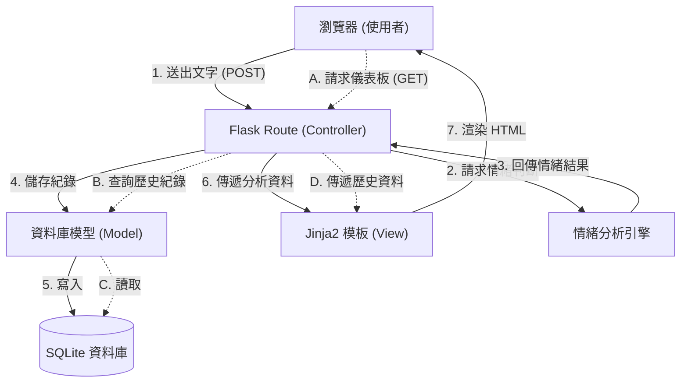

# EmpathEye 系統架構設計 (System Architecture)

## 1. 技術架構說明

本專案採用輕量級的 Web 開發架構，適合小型專題且能快速驗證核心概念。

### 1.1 選用技術與原因
- **前端：HTML5 / CSS3 / Vanilla JavaScript**
  - **原因**：符合課堂統一規範，且專案初期互動邏輯單純，不使用框架（如 React/Vue）能大幅降低學習曲線與專案複雜度。圖表呈現使用 `Chart.js` 達到視覺化需求。
- **後端：Python + Flask**
  - **原因**：Flask 是極為輕量且靈活的 Python 網頁框架，適合用來快速建立 RESTful API，並能輕鬆整合 Python 豐富的 NLP 生態系（用於情緒分析）。
- **模板引擎：Jinja2**
  - **原因**：Flask 內建的模板引擎，能在伺服器端直接將資料渲染至 HTML 頁面，不需前後端分離，簡化開發流程。
- **資料庫：SQLite**
  - **原因**：無需額外架設資料庫伺服器，資料儲存於單一本地檔案中，非常適合中小型專題，也確保資料僅限本地存取，符合安全性要求。

### 1.2 Flask MVC 模式說明
專案採用經典的 Model-View-Controller (MVC) 模式設計：
- **Model (模型)**：對應 `app/models/`，負責定義資料庫 Schema（如 `Record` 表單）並處理與 SQLite 的互動邏輯。
- **View (視圖)**：對應 `app/templates/`，使用 Jinja2 結合 HTML/CSS 呈現最終頁面，將後端傳來的資料顯示給使用者。
- **Controller (控制器)**：對應 `app/routes/`，接收前端的請求（如表單送出），呼叫情緒分析引擎，然後將結果回傳給 View 進行渲染。

---

## 2. 專案資料夾結構

以下為 EmpathEye 專案的資料夾結構與職責分配：

```text
EmpathEye/
├── app/                      # 應用程式主目錄
│   ├── __init__.py           # Flask 應用程式初始化、配置載入
│   ├── models/               # 資料庫模型 (Model)
│   │   ├── db.py             # 資料庫連線設定
│   │   └── record.py         # 情緒紀錄資料表定義與操作
│   ├── routes/               # 路由與控制器 (Controller)
│   │   ├── index.py          # 首頁與基本路由
│   │   └── analyze.py        # 處理情緒分析與回覆建議之 API/路由
│   ├── templates/            # Jinja2 HTML 模板 (View)
│   │   ├── base.html         # 網頁共同版型 (Header, Footer, Navbar)
│   │   ├── index.html        # 首頁 (輸入文字分析區)
│   │   └── dashboard.html    # 情緒歷史儀表板 (Chart.js 圖表)
│   └── static/               # 靜態資源檔案
│       ├── css/              # 樣式表 (style.css)
│       ├── js/               # 前端腳本 (main.js, chart_render.js)
│       └── images/           # 圖片資源
├── instance/                 # 本地環境實例資料夾
│   └── database.db           # SQLite 資料庫檔案 (不進版控)
├── docs/                     # 專案文件目錄
│   ├── PRD.md                # 產品需求文件
│   └── ARCHITECTURE.md       # 系統架構文件 (本文)
├── requirements.txt          # Python 依賴套件清單 (Flask, etc.)
└── app.py                    # 專案啟動入口檔
```

---

## 3. 元件關係圖

以下展示使用者操作時，系統內部的資料流與元件互動關係。



---

## 4. 關鍵設計決策

1. **不採用前後端分離架構**
   - **原因**：為了在短時間內產出 MVP (最小可行性產品)，直接使用 Jinja2 渲染 HTML 可以省去建置與維護前端框架 (如 React) 及跨網域 (CORS) 問題的成本，讓團隊專注於情緒分析邏輯。
2. **內建 SQLite 資料庫**
   - **原因**：考量到「非功能性需求」中要求資料僅限本地存取，不涉及複雜的異地連線，且專案目前無多帳號系統。SQLite 是免安裝、零配置的輕量級最佳選擇。
3. **模組化路由設計 (Blueprints)**
   - **原因**：在 `routes/` 目錄中，會透過 Flask 的 Blueprint 將功能拆分。這符合「分工模組化開發」的時程規劃，讓不同組員能分別開發自己負責的路由模組，避免 Git 衝突。
4. **前端圖表分離設計**
   - **原因**：將 `Chart.js` 相關的繪圖邏輯獨立放在 `static/js/chart_render.js` 中，後端僅透過 Jinja2 將統計數據以變數注入至 HTML，可確保 HTML 結構乾淨，也便於前端視覺化調整。
